# H23-E5-GR1-Circuit-Electrique
### Par Adam Hamid Salah Salah et Thanh An Kha Nguyen
-         Description
Notre application web consiste en un simulateur de circuits électriques. Dans celui-çi, les utilisateurs pourront créer, partager et visualiser des circuits à l’aide d’une interface simple, propre, et facile d’accès. Il sera possible de sauvegarder des projets pour y retourner plus tard. L’interface sera “drag and drop” et plusieurs informations pertinentes sur le circuit et les composantes seront affichées
-         Besoins
Un des cours les plus lourds durant un parcours cégépien est souvent celui de physique. Plus précisément celui d’Électricité et Magnétisme. Pour la plupart, cette classe traite des concepts jamais abordés auparavant. Certains auront probablement besoin d’aide supplémentaire en dehors des classes afin de réussir le cours. Leurs apprentissages pourraient potentiellement s’accélérer avec un site Web interactif qui les aiderait à visualiser un circuit électrique et ses fonctions. 
-         Acteurs
Toutes personnes de niveau débutant cherchant à s’éduquer sur les circuits électriques, ainsi que des professeurs souhaitant enseigner la matière à leurs élèves et des personnes dans le métier
-         Technologies / Tutoriels
Pour l’interface graphique de notre Site Web, nous utiliserons une combinaison de HTML, CSS, Javascript ainsi que React comme framework. Nous utiliserons Django pour coder le back-end avec Python et SQL pour communier à une base de données.
-         Liens avec d’autres disciplines
Lien avec la physique (Électricité et magnétisme).
-         Nouveauté innovation
Quelques simulateurs de circuits électriques déjà en ligne. Cependant, ils exigent tous au moins une compréhension de base dans ce sujet. Notre site Web, au contraire, sera équipé d’outils visant à aider un débutant complet. Un utilisateur qui ne connaît rien des circuits électriques pourra donc utiliser notre site facilement et d’en apprendre sans avoir besoin d’autres sources externes. De plus, l’interface sera plus simple. La plupart des sites mentionnés utilisent une interface graphique datée qui est intuitive à utiliser.
-         Gantt planification de travail
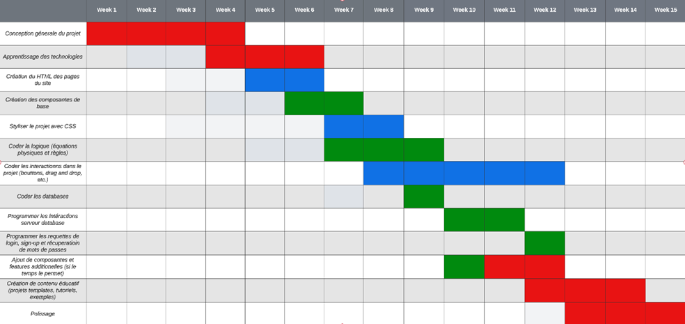
-	      Écran vue (interface homme machine IHM)
Voiçi plusieurs exemples de pages que notre site contiendra. Ce sont les éléments avec lesquels les utilisateurs de notre site se familiariseront.
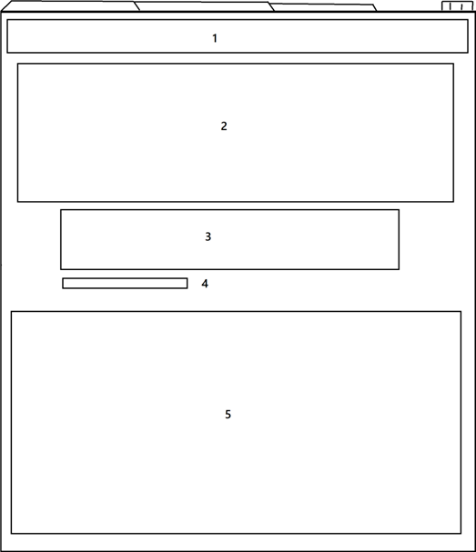
Page d’accueil
1- Index de pages
2- Image d’accueil du site
3- Login
4- Sign up
5- Informations importantes sur le site
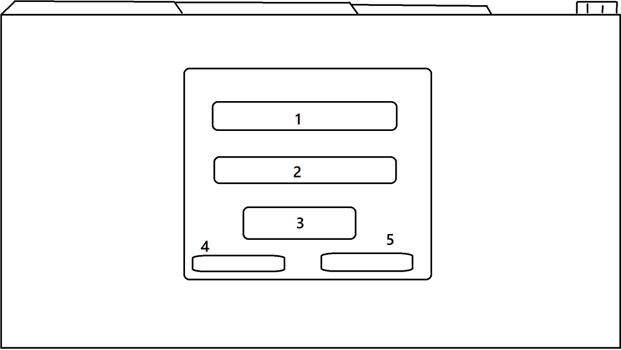
Login
1- Email
2- Mot de passe
3- Entrer
4- Pas de compte? Sign up
5- Mot de passe oublié
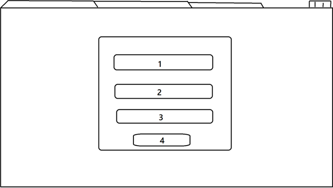
Sign up
1- Nom d’affichage
2- Email
3- Mot de passe
4- Entrer
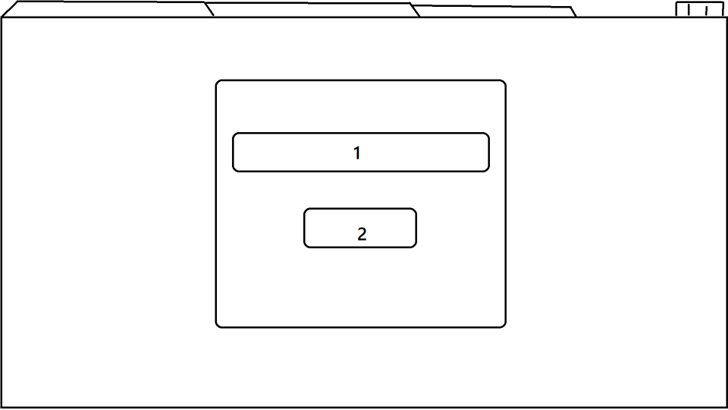
Mot de passe oublié (partie 1)
1- Email
2- Entrer
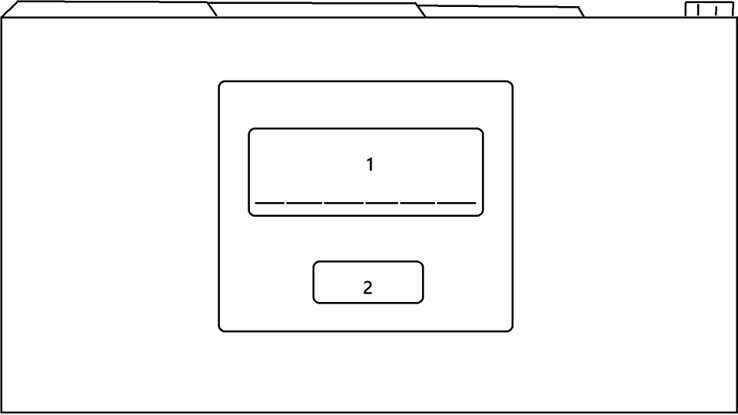
Mot de passe oublié (partie 2)
1- Mot de passe à 6 chiffres de vérification
2- Entrer
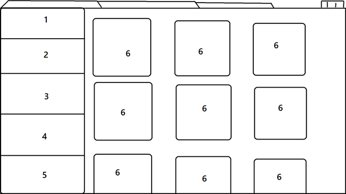
Liste des projets
1- Projets “templates”
2- Projets publiques et recherche de projets
3- Projets personnels
4- Projets “partagés avec moi”
5- Projets tutoriels
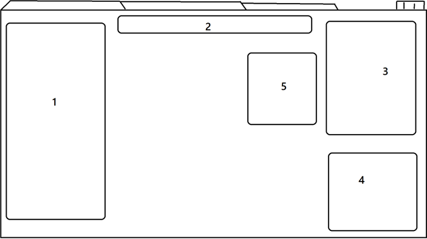
Espace de travail
1- Liste de composantes électriques
2- Barre polyvalente (sauvegarder, ctrl z, partager, changer de type de vue, etc.)
3- Information sur la composante sélectionnée
4- Informations générales
5- Tutoriels et informations (si lieu)
Tous les éléments de l’espace de travail sont dissimulables.
-         Diagramme de classe
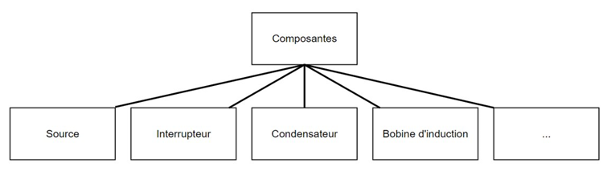
Une classe parent Composantes et plusieurs classes enfant qui représente chaque composante d’un circuit électrique.
-         Cas d’utilisations
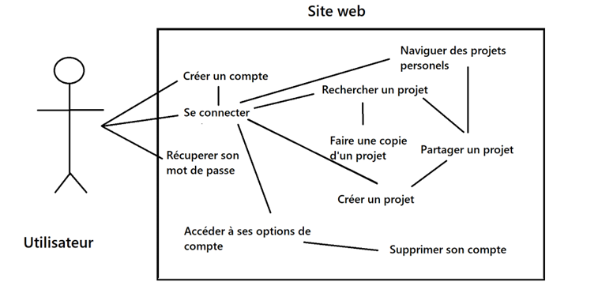
-        Architecture
Voici la façon dont nous allons structurer notre projet.
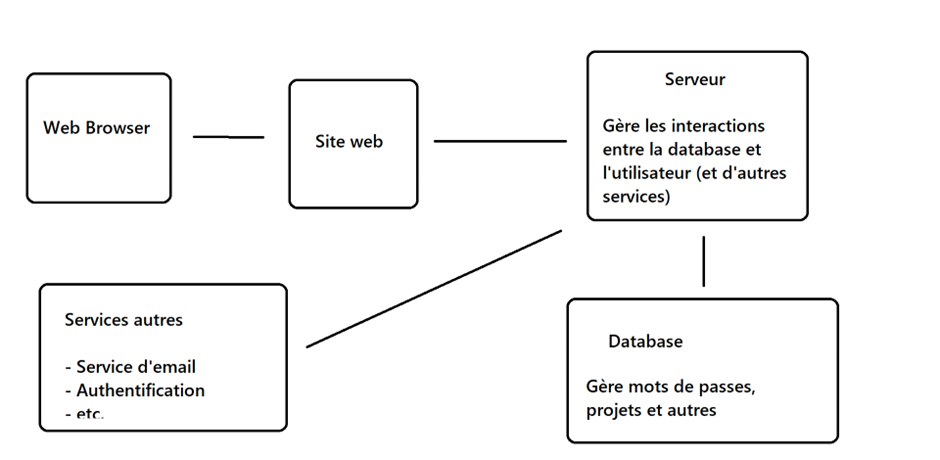
-         Perspectives
Nous planifions d’ajouter plusieurs composantes électriques et un quantité satisfaisante d’information sur le circuit électrique. Malgré cela, il sera impossible de tout inclure dans notre projet, par soucis de temps et de difficulté. Nous voudrions programmer plus de fonctionnalités et éléments dans le futur, pour avoir une application la plus complète possible en termes de construction de circuits.
